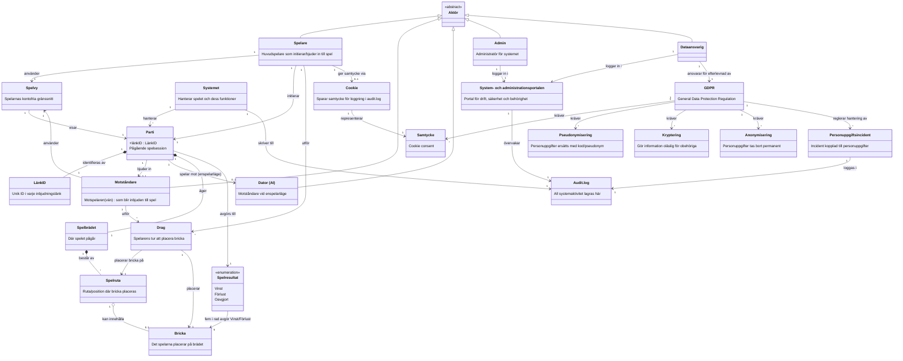

# Förklaring till modellen

Spelbegrepp: En Spelare initierar ett Parti och bjuder in en Motståndare (via en LänkID) eller spelar mot Dator (AI) i enspelarläge. Partiet äger ett Spelbrädet som består av flera Spelruta. Genom ett Drag placerar spelaren en Bricka på en spelruta. Partiet avgörs till ett Spelresultat: Vinst, Förlust eller Oavgjort.

Systembegrepp: Systemet hanterar alla pågående partier och skriver all aktivitet till Audit.log. Admin och Dataansvarig loggar in i System- och administrationsportalen för att hantera drift, säkerhet och behörigheter — separat från spelarnas kontofria Spelvy.

GDPR/integritetsbegrepp: GDPR styr hur personuppgifter hanteras genom krav på Samtycke (via Cookie), Pseudonymisering, Kryptering och Anonymisering, samt hur en eventuell Personuppgiftsincident ska loggas och hanteras.
