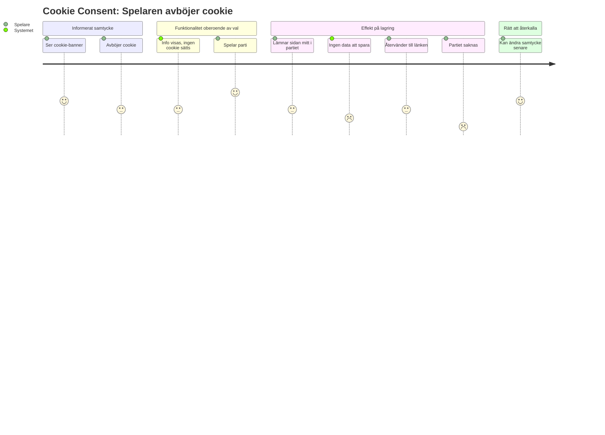
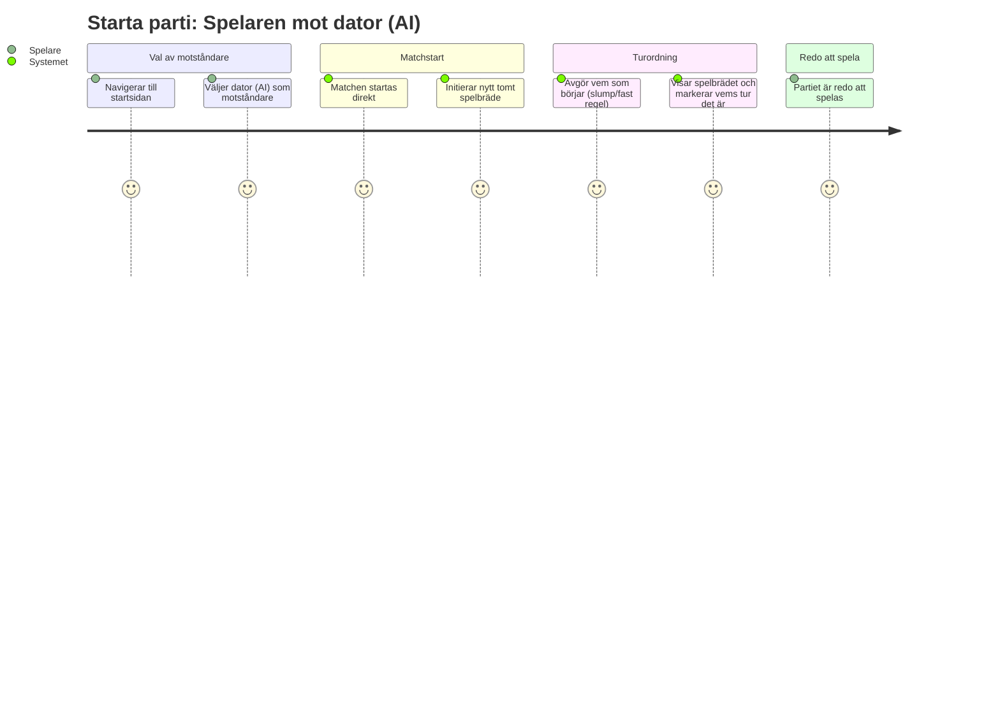
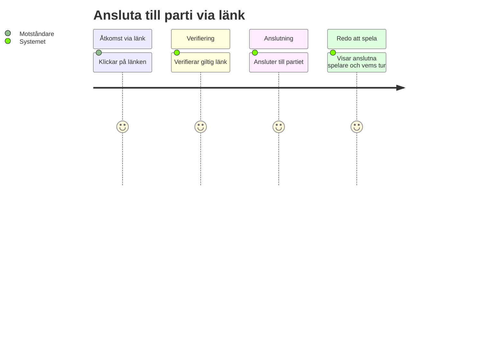
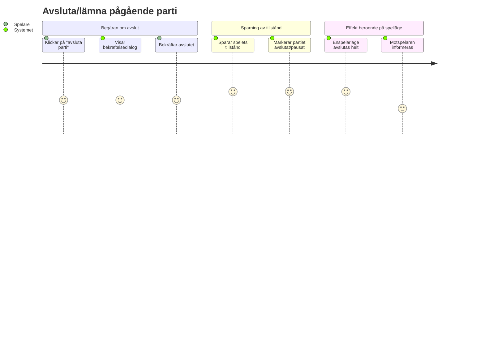

# 6. User journey

## UJ-01: Spelaren samtycker till cookie

## UJ-02: Spelaren nekar samtycke till cookie

## UJ-03: Spelaren startar parti mot dator (AI)
 

## UJ-04: Motståndare ansluter till parti via länk
 

 
## UJ-05: Spelaren avslutar/lämnar pågående parti
 

