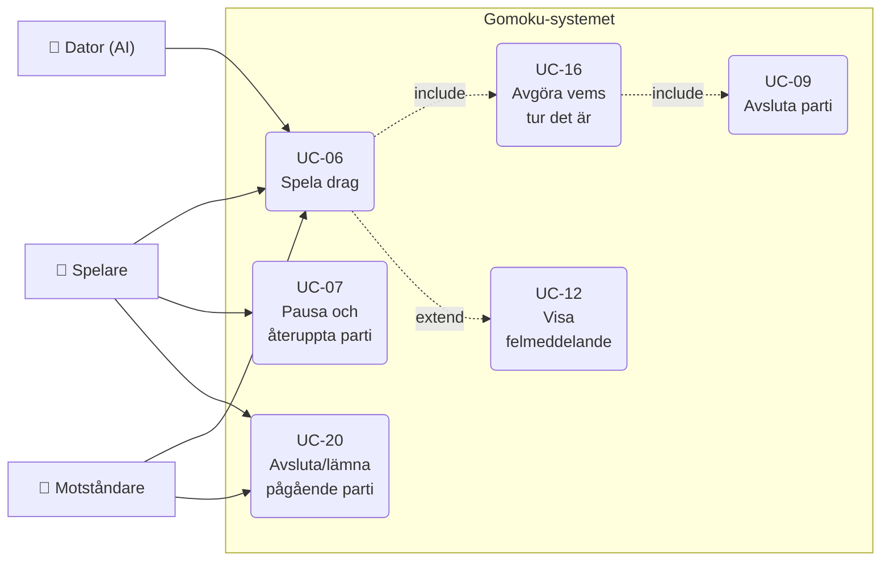
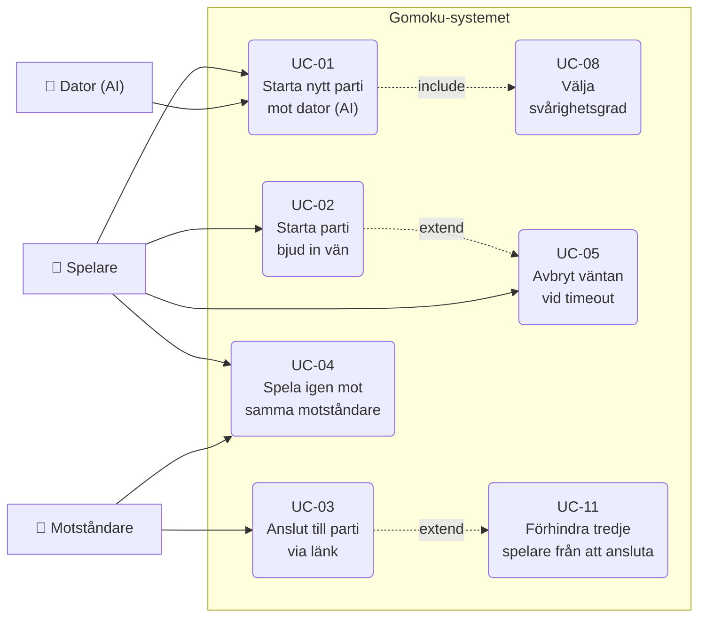
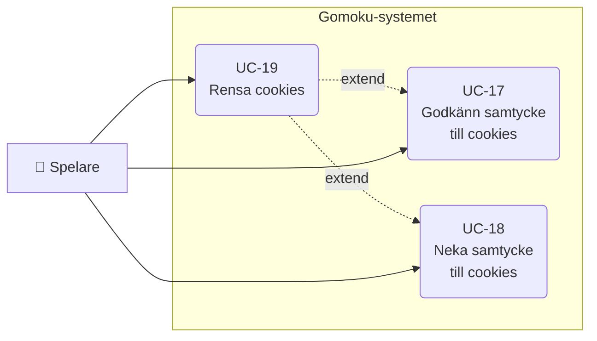
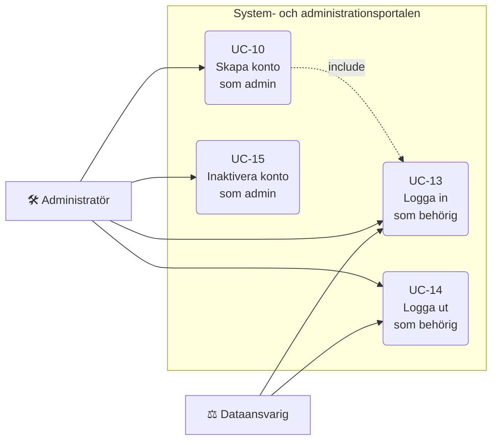
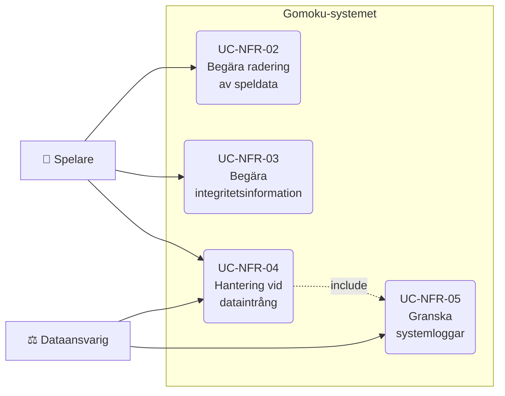
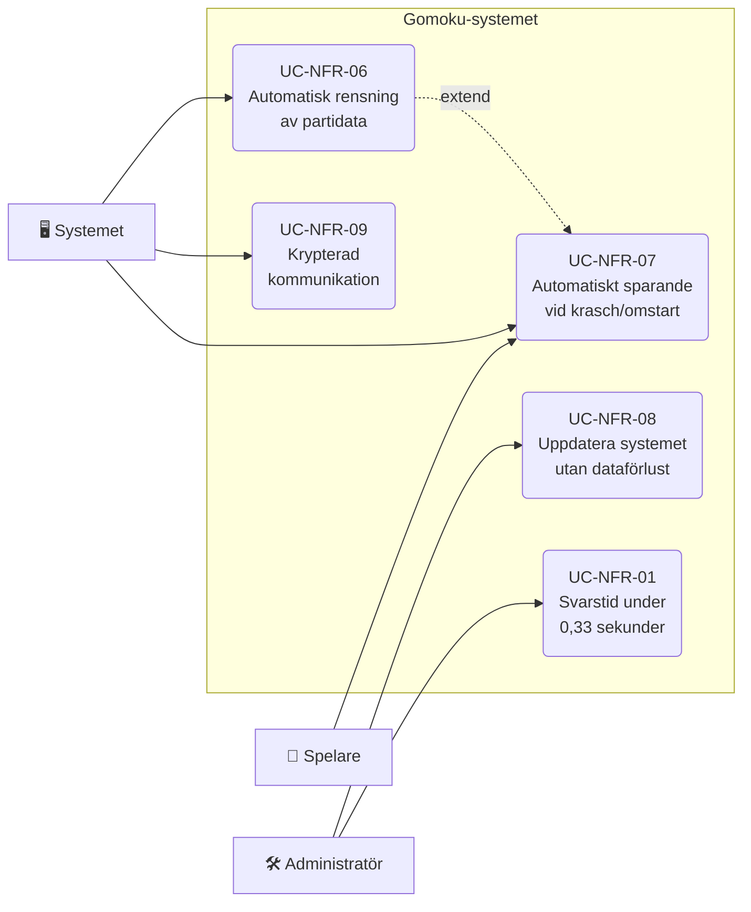

[Tillbaka till README](../../README.md)
# 7. Use Cases Overview

## 7.1 Aktörer

|  Aktör | Beskrivning |
|--------------|-------|
| Spelare (S)| Använder systemet för att starta och spela spel mot en vän eller datorn. |
| Motståndare (M)| Den andra spelaren (mänsklig) som deltar i samma parti via inbjudningslänk. |
| Dator (AI) | Spelar automatisk mot spelaren och gör drag enlig spelets regler. |
| Administratör (A)| Hanterar användare, behörigheter och tekniska problem. |
| Dataansvarig (DA)| Ansvarar för GDPR, dataradering och personuppgiftsincidenter. |
| Systemet (SYS)| Kontrollerar drag och hanterar sparade och inaktiva spel. |

---
 
## 7.2 Funktionella Use Cases
 
| UC-ID | Use Case-namn | Primär aktör | Sekundär aktör | Kopplat krav |
|-------|--------------|--------------|-----------------|-----------|
| UC-01 | Starta nytt parti mot dator (AI) | S | AI | FR-01.1, FR-01.4, NFR-02.1, NFR-02.2, NFR-02.4 |
| UC-02 | Starta parti bjud in vän | S, M | — | FR-01.2, NFR-02.1, NFR-02.2, NFR-02.4, NFR-04.3 |
| UC-03 | Anslut till parti via länk | M | S | FR-01.2, FR-01.9, NFR-02.2, NFR-02.4 |
| UC-04 | Spela igen mot samma motståndare | S, M | — | FR-01.3, NFR-02.1 |
| UC-05 | Avbryt väntan vid timeout | S | — | FR-01.11, NFR-06.1 |
| UC-06 | Spela drag | S | M, AI | FR-01.6, FR-01.8, NFR-02.1 |
| UC-07 | Pausa och återuppta parti | S | — | FR-01.13, NFR-05.1 |
| UC-08 | Välja svårighetsgrad | S | — | FR-01.15 |
| UC-09 | Avsluta parti | SYS | S, M | FR-01.5, NFR-02.1 |
| UC-11 | Förhindra tredje spelare från att ansluta | S | SYS | FR-01.12, NFR-06.1 |
| UC-12 | Visa felmeddelande | SYS | S, M, A | FR-01.14, NFR-02.3 |
| UC-16 | Avgöra vems tur det är | SYS | S, M | FR-01.7, FR-01.8, NFR-02.1 |
| UC-20 | Avsluta/lämna pågående parti | S | M | FR-01.16, NFR-05.1 |
 
### 7.2.1 Spelloop (kärnspel)
 

 
### 7.2.2 Starta parti
 

 
### 7.2.3 Cookie-hantering
 
| UC-ID | Use Case-namn | Primär aktör | Sekundär aktör | Kopplat krav |
|-------|--------------|--------------|-----------------|-----------|
| UC-17 | Godkänn samtycke till cookies | S | — | FR-02.2, FR-02.3, NFR-01.3, NFR-01.4, NFR-09.5, NFR-09.6 |
| UC-18 | Neka samtycke till cookies | S | — | FR-02.2, FR-02.3, NFR-09.5 |
| UC-19 | Rensa cookies | S | — | FR-02.3, NFR-09.5 |
 

 
---
 
## 7.3 Administration & Autentisering
 
| UC-ID | Use Case-namn | Primär aktör | Sekundär aktör | Kopplat krav |
|-------|--------------|--------------|-----------------|-----------|
| UC-10 | Skapa konto som admin | A | — | FR-02.6, NFR-09.3 |
| UC-13 | Logga in som behörig | A, DA | — | FR-02.1, NFR-09.3 |
| UC-14 | Logga ut som behörig | A, DA | — | FR-02.1, NFR-09.3 |
| UC-15 | Inaktivera konto som admin | A | — | FR-02.6, FR-02.8, NFR-06.3, NFR-07.2, NFR-09.3 |
 
### 7.3.1 Kontohantering
 

 
---
 
## 7.4 Icke-funktionella / GDPR Use Cases
 
| UC-ID | Use Case-namn | Primär aktör | Sekundär aktör | Kopplat krav |
|-------|--------------|--------------|-----------------|------------|
| UC-NFR-01 | Genomsnittlig svarstid under spelgång under 0,33 sekunder på 1000 cypresstester | A | SYS | NFR-03.1, NFR-03.2, NFR-04.1, NFR-04.2 |
| UC-NFR-02 | Begära radering av speldata | S | DA | FR-02.7, NFR-09.1 |
| UC-NFR-03 | Hantera begäran om integritetsinformation | S | DA | FR-02.4, NFR-09.4 |
| UC-NFR-04 | Hantering av information vid dataintrång | S | DA | FR-02.5, NFR-09.2 |
| UC-NFR-05 | Granska systemloggar | — | — | *(saknas – se anmärkning nedan)* |
| UC-NFR-06 | Automatisk rensning av partidata | SYS | — | FR-02.9, NFR-01.2, NFR-08.1 |
| UC-NFR-07 | Automatiskt sparande av speldata vid krasch eller omstart | SYS | S | FR-01.13, NFR-01.1, NFR-05.1 |
| UC-NFR-08 | Uppdatera systemet utan att pågående partier går förlorade | A | S, SYS | FR-01.13, NFR-08.2 |
| UC-NFR-09 | Säkerställa krypterad kommunikation mellan klient och server | SYS | S, M | FR-01.1, NFR-01.4, NFR-06.2, NFR-09.6 |
 
### 7.4.1 Dataskydd & Insyn
 

 
### 7.4.2 Speldata & Drift
 

 
---
 
## 7.5 Use Case Priority Matrix
 
| Prioritet | Use Cases |
|----------|----------|
| Kritiskt | UC-01, UC-02, UC-03, UC-06, UC-09, UC-16, UC-12, UC-NFR-01, UC-NFR-07, UC-NFR-09 |
| Bör ha | UC-04, UC-05, UC-07, UC-08, UC-11, UC-20, UC-17, UC-18, UC-19, UC-NFR-02, UC-NFR-03, UC-NFR-06 |
| Kan ha | UC-10, UC-13, UC-14, UC-15, UC-NFR-04, UC-NFR-05, UC-NFR-08 |

(*Alla diagram har tagits fram med hjälp av Claude AI*)

