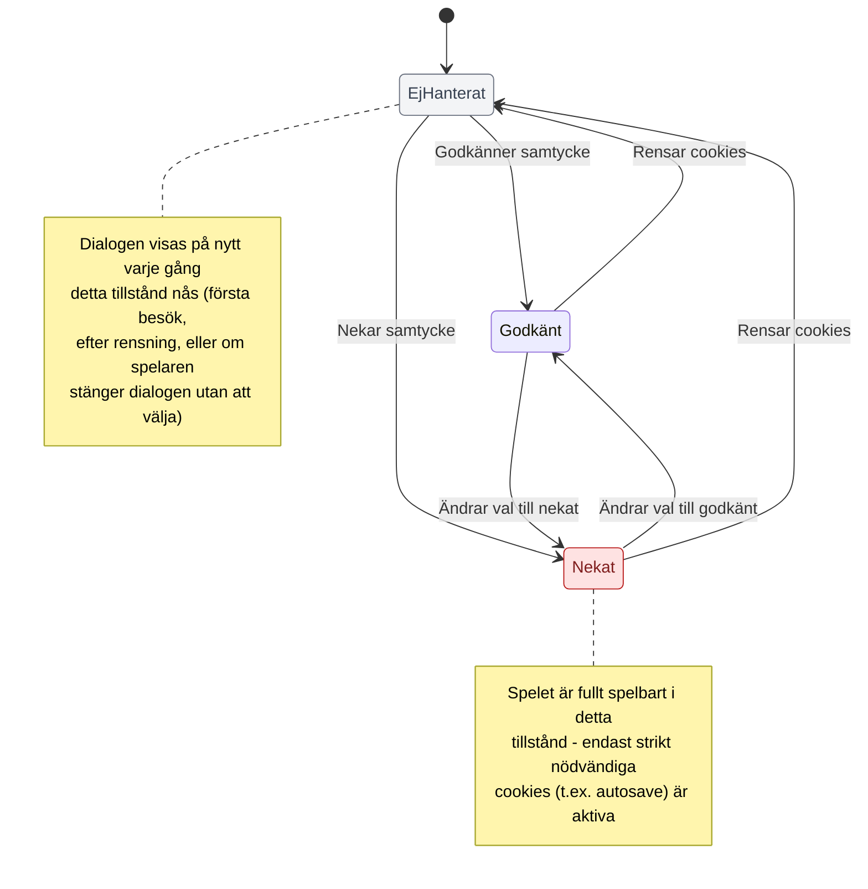

[Tillbaka till README](../../README.md)
# 8. Diagram

## 8.1 Tillståndsdiagram
| Diagram | Täcker Use case| 
| ----------- | ----------- | 
|    Cookie-samtycke |UC-17, UC-18, UC-19| 
|    Partiets tillstånd |UC-01, UC-02, UC-03, UC-04, UC-05, UC-07, UC-09, UC-11, UC-20| 
|    Administratörskonto |UC-10, UC-13, UC-14, UC-15| 

**Tillståndsdiagram: Cookie-samtycke**
 

## 8.2 Aktivitetsdiagram
| Diagram | Täcker Use case| 
| ----------- | ----------- | 
|    Cookie-hantering |UC-17, UC-18, UC-19| 
|    Starta parti |UC-01, UC-08, UC-02, UC-03, UC-05, UC-11| 
|    Spelloop |UC-06, UC-16, UC-12, UC-07, UC-20| 
|    Efter avslutat parti |UC-04| 
