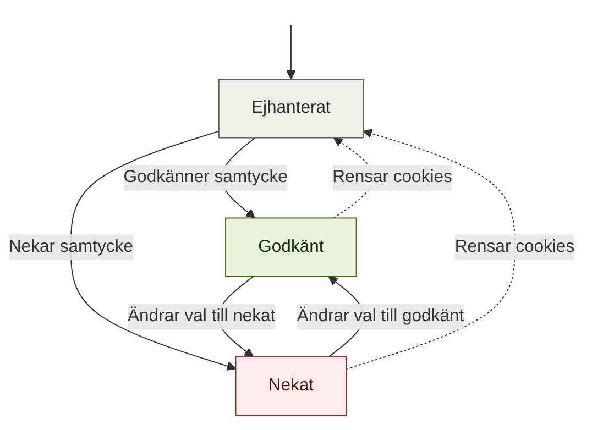

```mermaid
flowchart TD
    start(( )) --> Ejhanterat["Ejhanterat"]

    Ejhanterat -->|Godkänner samtycke| Godkant["Godkänt"]
    Ejhanterat -->|Nekar samtycke| Nekat["Nekat"]

    Godkant -->|Ändrar val till nekat| Nekat
    Nekat -->|Ändrar val till godkänt| Godkant

    Godkant -.->|Rensar cookies| Ejhanterat
    Nekat -.->|Rensar cookies| Ejhanterat

    classDef godkant fill:#EAF3DE,stroke:#3B6D11,color:#173404;
    classDef nekat fill:#FCEBEB,stroke:#A32D2D,color:#501313;
    classDef neutral fill:#F1EFE8,stroke:#5F5E5A,color:#2C2C2A;
    classDef starty fill:none,stroke:none;

    class Godkant godkant
    class Nekat nekat
    class Ejhanterat neutral
    class start starty
```
